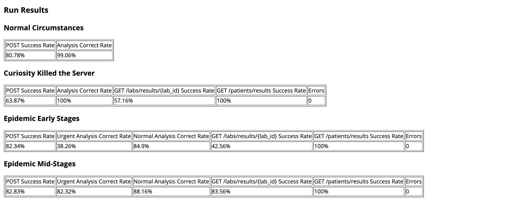
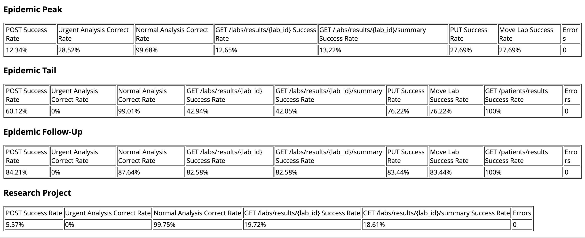

# CoughOverflow
Cough Overflow is a backend REST API server that handles client requests. 

Tech stack includes: 
- Backend built in python using FastAPI framework.
- Docker image has been made for this webserver. (Docker.yml)
- Docker image for analysis engine was alsoc created.
- Deployed on AWS using Terraform. 

## CoughOverflow Pathogen Analysis Service

This repository contains the backend service for CoughOverflow’s Pathogen Analysis Service (PAS). The service exposes a REST API that allows pathology labs and healthcare systems to submit sample images for analysis and later retrieve the results.

The PAS acts as a scalable microservice that:

- Accepts image analysis requests via a specified REST API.
- Uses the provided `overflowengine` tool to detect COVID-19 and H5N1 (avian influenza) markers in pre-processed saliva sample images.
- Persists analysis requests and results to durable storage to prevent data loss, even in the event of service failure or restart.
- Is designed to remain responsive under varying and potentially high load, supporting both individual result queries and batched queries for labs or patients.
- Is deployable to AWS using Terraform, enabling automated provisioning and testing in a fresh cloud environment.

The overall purpose of this system is to provide a reliable, cloud-hosted analysis pipeline that can scale to epidemic-level demand, delivering timely, automated pathogen detection to support clinical decision-making and public health response.

## Repo Structure (Stage#1, Stage#2, Stage#3):
Each branch represents the code at different stages. 
### Stage 1 – Containerised Web Server

Stage 1:
- Dockerfile and associated config for building the web server image.
- Local development and testing using Docker (e.g. `docker run` / `docker-compose`).

### Stage 2 – AWS Deployment

Stage 2 is about deploying the containerised service to AWS:

- Infrastructure-as-code to provision required AWS resources (e.g. ECS/ECR, networking, etc.).
- CI/CD or deployment scripts to push the Docker image and update the running service.
- Configuration to run the web server in the cloud (environment variables, task definitions, etc.).

### Stage 3 – Optimised Deployment with Celery

Stage 3 improves scalability and responsiveness by using asynchronous task processing like queues:

- Celery worker(s) added to offload long-running analysis jobs from the web server.
- A message broker / queue (e.g. Redis or SQS) for distributing jobs to workers.
- Updated deployment so both web and worker components are managed and scaled in AWS.
- Optimised flow: web API enqueues analysis jobs, workers process them, results are stored in a postgress DB and later retrieved using API's.

### Testing
The server was then stress tested using k6 tests with these scenarios: 
- **Normal Circumstances**: Average number of analysis requests are submitted by a wide range of labs. These requests are distributed fairly evenly over the working day. Few of the analysis requests are urgent. Queries for results are also distributed fairly evenly over the day.
- **Curiosity Killed the Server**: Queensland Health creates a web portal allowing patients to view their analysis results. Tens of thousands of people all try to access their results in a short period of time.
- **Epidemic Early Stages**: There is a significant increase in the number of analysis request submitted by a few labs. These labs also mark a much higher number of the requests as being urgent. Other labs are operating as per normal circumstances. There are many more queries for results, often being repeated for any pending analysis jobs. Health authorities make many requests for batches of results from labs or for patients.
- **Epidemic Mid Stages**: There are periods of time where several labs submit a large volume of analysis requests. There are other periods of time with reduced numbers of analysis requests. Up to 15% of the requests may be given an urgent status. Queries for results follow the same fluctuating pattern as analysis requests. Health authorities make a moderate number of requests for batches of results from labs or for patients.
- **Epidemic Peak**: Almost all labs submit a very large volume of analysis requests. Up to 30% of the requests may be given an urgent status. The service must still analyse non-urgent requests in a timely manner. If it does not, the risk is that labs will start to make all requests urgent. Due to the high volume of analysis requests, there will be a high volume of queries for results. Any results that are still pending analysis jobs, will be repeated. Health authorities make a moderate number of requests for batches of results from almost all labs. Labs start querying batches of results for individual patients.
- **Epidemic Tail**: Almost all labs submit a large volume of analysis requests, but timing may be variable. Up to 10% of the requests may be given an urgent status. Due to the high volume of analysis requests, there will be a high volume of queries for results. Most results that are still pending analysis jobs, will be repeated. Health authorities make a moderate number of requests for batches of results from almost all labs. Labs query batches of results for a moderate number of patients.
- **Epidemic Follow-up**: Some labs submit a large volume of analysis requests. Up to 5% of the requests may be given an urgent status. Other labs are back to operating as per normal circumstances. There will be a moderate volume of queries for results. Most results that are still pending analysis jobs, will be repeated. Health authorities make a large number of requests for batches of results from almost all labs. Labs query batches of results for a large number of patients.
- **Research Project**: A researcher wants to analyse the progression of how a disease spreads in the com-
munity. They will query all the results from all the labs to generate their database of infections in different
areas. The system must remain responsive to analysis requests while processing the researcher’s queries.

### Results (K6 Tests)

